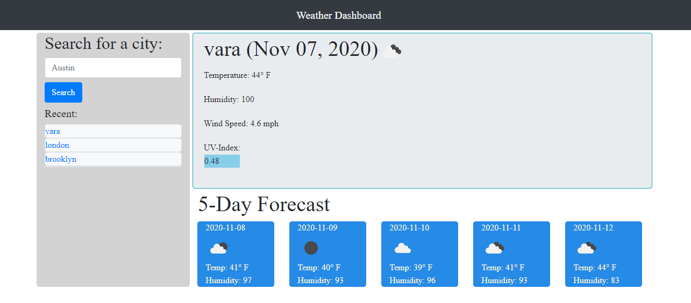

# Weather-Dashboard-1
Did you ever wonder what the weather was outside? I know I did. And by golly, I didnt have a way to find out! My house had no windows to see outside, no doors to open which I could poke my head out of and have a sniff of the air. So, I decided to make an app to do all this for me. Now, I can simply search for a city, and voila! I know the weather of whichever city I want!
 
## Screenshots

## API Reference

This is the API used to acquire lat & lon for desired city: https://api.openweathermap.org/data/2.5/weather
This is the API used for todays weather: https://api.openweathermap.org/data/2.5/onecall
This is the API used to acquire weather condition icons: https://openweathermap.org/img/wn/
This is the API used for the 5 day forecast: https://api.openweathermap.org/data/2.5/forecast

## How to use?
Simply enter a city into the search field, and click search or press enter! You can also click on a previously searched city to retrieve the weather data for that city. Try it [here!](https://phillipmerriman.github.io/Weather-Dashboard-1/)

MIT © [Phillip Merriman](https://github.com/phillipmerriman)